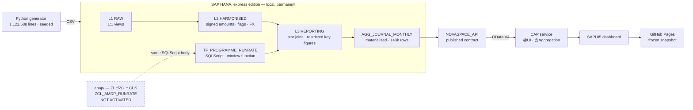

# NovaSpace Finance Cockpit

**An end-to-end SAP BI product: month-end close and space-programme controlling, from 1.1 million synthetic ledger lines to a hosted dashboard.**

### ▶ [Open the live demo](https://aymane-git21.github.io/nova-finance-bi/)

No login, no backend, nothing to start. It opens.

> **Working on this repo?** [`START-HERE.md`](START-HERE.md) is the current to-do list.

---

## The question

> *Why is the period close slow, and which space programmes are burning budget faster than planned?*

*NovaSpace Group* is a fictional European space company: four entities, ten programmes, €940 m of annual revenue. Its finance team closes the books every month and controls a portfolio of satellite, launcher and ground-segment programmes.

Three findings are buried in the data. The cockpit surfaces them without captioning them:

| | |
|---|---|
| **One entity closes 3 days slower than the rest** | 8.2 working days against 5.1–5.4 — and the manual-posting share underneath (22 % vs 13 %) shows the mechanism, not just the symptom |
| **One programme is running away** | `PRG-KESTREL` sits 7 points above the on-plan line and its estimate at completion is **127 % of budget**, while the other nine sit at 95–98 % |
| **Part of one entity's cost growth is the exchange rate, not spending** | −€4.4 m of FX impact on the UK entity; the three euro entities net to exactly zero |

All data is synthetic and reproducible from a fixed seed. No real or client data appears anywhere.

---

## Architecture



`L1 / L2 / L3` is **LSA++ transplanted onto native HANA**. [`docs/bw4hana-mapping.md`](docs/bw4hana-mapping.md) maps every object to its BW/4HANA equivalent — ADSO, CompositeProvider, DTP, BEx query elements — and is honest about the four things BW gives you that a native build has to reinvent.

---

## Requirements → evidence

| Requirement | Evidence | Status |
|---|---|---|
| **BW/4HANA developments** | L1/L2/L3 layered model, 31 views, restricted key figures, input-parameterised table function, plus the object-by-object [BW/4HANA mapping](docs/bw4hana-mapping.md) | ✅ Built on HANA-native, mapped to BW |
| **SAP HANA** | HANA Express, 1.12 M lines loaded, column store, [performance work](docs/performance-report.md) with measured before/after | ✅ Built |
| **ABAP** | [`ZCL_AMDP_RUNRATE`](abap/src/zcl_amdp_runrate.clas.abap) — the SQLScript body **runs and is benchmarked**; the ABAP wrapper is authored | ⚠️ Logic proven, wrapper **not activated** |
| **CDS** | Full `ZI_*` / `ZC_*` stack with associations, `@Semantics`, `@Analytics.query`, `@UI` | ⚠️ Authored, **not activated** |
| **OData V4** | [CAP service](cap/) over HANA, `$apply` aggregation, annotation-driven metadata | ✅ Built and running |
| **UI5 / Fiori** | Hand-written `sap.viz` dashboard, [hosted](https://aymane-git21.github.io/nova-finance-bi/) | ✅ Built and live |
| **SAC** | Tenant unavailable. Curated extracts built; concept mapping written | ❌ **Not demonstrated** — [why](docs/sac-and-bpc.md) |
| **BPC** | Version dimension and rolling forecast snapshots modelled; no planning application | ⚠️ Data model only |
| **BO / Lumira / AfO** | Professional experience. Repo carries the [migration decision matrix](docs/bi-roadmap.md) | ➖ Not self-hostable |
| **Eco-design** | [66 % of server-side execution removed](docs/performance-report.md), retention tiering, scheduling policy | ✅ Measured |
| **Agile delivery** | [21-story backlog](docs/backlog.md), MoSCoW, acceptance criteria, honest implemented/not column | ✅ |
| **Golden rules** | [Development standards](docs/golden-rules.md), including where they were broken | ✅ |
| **Change management** | [Rollout plan](docs/change-management.md) built around the entity this cockpit exposes | ✅ |
| **Design thinking** | KPIs written before the schema; personas drive the backlog | ✅ |
| **Export control / GDPR** | [Data protection note](docs/gdpr-and-data-protection.md); user-level drill does not exist rather than being restricted | ✅ |

**The three ⚠️/❌ rows are the point of the table.** They could have been quietly omitted.

---

## What is verified, and how

Claims in a portfolio are worth what the checks behind them are worth.

| Check | Count | What it proves |
|---|---:|---|
| `pytest data-generator/tests` | **103** | The generator is reproducible and all six data stories are actually present — not merely intended |
| `python hana/verify_against_python.py` | **35** | Every KPI computed in SQL matches an independent Python implementation over the same seeded data |
| `python abap/check_sources.py` | **106** | ABAP sources are internally coherent and correctly labelled |

The second one is the load-bearing check. **Two implementations of the same eight KPIs, one in SQL and one in Python with a test suite behind it**, reconciled on every run. It has caught five defects no dashboard would ever have contradicted:

- FX impact overstated by €6,900 — reversals carry the original document's group amount, and differencing that against a budget-rate figure attributed the carry-over to FX
- Budget variance computed at two different grains, with a `FULL OUTER` on one side and a left join on the other
- A full-year budget flattering an open year by 43 %
- Materialisation rounding rate-multiplied measures at an intermediate grain — €1.20 on €650 m
- Materialisation collapsing special periods 13–16 onto period 12, so variance silently began including year-end adjustments

A number that only one implementation produces is a number nobody has checked.

---

## Run it

```bash
python data-generator/generate.py && python -m pytest data-generator/tests -q
```

That needs nothing but Python. For the full stack:

```bash
./hana/hxe.sh init && ./hana/hxe.sh start
python hana/load_data.py && python hana/deploy_views.py && python hana/apply_optimisations.py
python hana/verify_against_python.py
cd cap && npm install && npx cds serve --port 4004
```

HANA Express needs 8 GB of RAM (12 recommended). Details in [`hana/README.md`](hana/README.md).

---

## Repository map

| Path | Contents |
|---|---|
| [`data-generator/`](data-generator/) | Seeded generator, the **Python reference implementation of all eight KPIs**, 103 tests |
| [`hana/`](hana/) | Container lifecycle, loader, L1/L2/L3 SQL, the run-rate table function, benchmarks, cross-check |
| [`cap/`](cap/) | OData V4 service with `@UI` and `@Aggregation` annotations |
| [`fiori/`](fiori/) | The dashboard and the snapshot script |
| [`abap/`](abap/) | CDS stack and AMDP — authored, **not activated**, labelled in every file |
| [`docs/`](docs/) | KPI sheet, data dictionary, BW/4HANA mapping, backlog, golden rules, BI roadmap, change management, GDPR, performance report |
| [`docs/adr/`](docs/adr/) | Six architecture decision records |
| [`sac/`](sac/) | Curated extracts, live-vs-import note |
| [`ROADMAP.md`](ROADMAP.md) | The original plan, with every deviation recorded against it |

---

## Honest constraints

Short, and each paired with what shipped instead.

- **SAP BTP was never provisioned.** PAYG needs a support ticket; trial registration was blocked by an outage in SAP's phone verification. The landscape moved local and permanent instead ([ADR-002](docs/adr/002-fully-local-landscape.md)). Cost: no hands-on evidence of the BTP cockpit, entitlements or Cloud Foundry.
- **No ABAP system.** The Platform Trial needs 100 GB of disk against 62.7 GB free. So Phase 4 was split by what each layer could honestly claim: SQLScript **executed and benchmarked**, ABAP **authored and labelled**, CAP for the service Fiori actually consumes ([ADR-003](docs/adr/003-abap-evidence-strategy.md)).
- **SAC became unavailable** before the story was built. The consumption layer became Fiori/UI5, which has the advantage of never expiring ([ADR-004](docs/adr/004-consumption-layer-without-sac.md)). SAC and BPC product experience is **not demonstrated and not claimed** ([why](docs/sac-and-bpc.md)).
- **BO, Lumira and Analysis for Office cannot be self-hosted for free.** Covered by professional experience; the repo carries a [migration decision matrix](docs/bi-roadmap.md) instead — which corrects a common and expensive misreading: BI 4.3 mainstream maintenance ends **31 December 2026**, not 2031.

Three of the four SAP-hosted services this project planned to use were unreachable within one weekend. Everything built locally has run continuously. That shaped the architecture more than any technical preference did.

---

## License

MIT — see [LICENSE](LICENSE).
