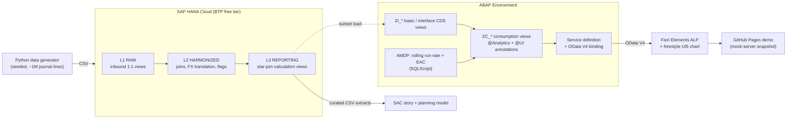

# NovaSpace Finance Cockpit

**An end-to-end SAP BI product: month-end-close and space-programme controlling analytics, built on SAP HANA Cloud, ABAP CDS/AMDP, OData V4, SAP Fiori and SAP Analytics Cloud.**

> **Status: in progress.** This README is rewritten into its final pitch form in Phase 9. Until then it tracks what exists and what does not. See [ROADMAP.md](ROADMAP.md) for the full build plan.

---

## The question this product answers

> *"Why is the period close slow, and which space programmes are burning budget faster than planned?"*

*NovaSpace Group* is a fictional European space company with four entities (ES / FR / DE / UK). Its finance team runs a month-end close every period and controls a portfolio of satellite, launcher and ground-segment programmes. This repository builds the analytics layer that answers both questions — from synthetic ERP-shaped source data all the way to a CFO-facing story.

**All data is synthetic**, generated by a seeded Python script ([`data-generator/`](data-generator/)). No real or client data appears anywhere in this repository.

---

## Target architecture

The `L1 / L2 / L3` split is LSA++ transplanted onto native HANA. [`docs/bw4hana-mapping.md`](docs/bw4hana-mapping.md) maps every object to its BW/4HANA equivalent (ADSO, CompositeProvider, DTP, BEx query elements) and records what would differ in a real BW/4 system.

---

## Repository map

| Path | Contents |
|---|---|
| [`ROADMAP.md`](ROADMAP.md) | The full build plan, phase by phase, with tick boxes |
| [`docs/`](docs/) | KPI sheet, data dictionary, BW/4HANA mapping, golden rules, BI roadmap & migration matrix, change-management plan, GDPR note, performance & eco-design report |
| [`docs/adr/`](docs/adr/) | Architecture decision records |
| [`data-generator/`](data-generator/) | Seeded synthetic ERP data generator + sample CSVs + test suite |
| [`hana/`](hana/) | Calculation-view sources, SQL, HDI artifacts, loader and instance-start scripts |
| [`abap/`](abap/) | CDS view stack, AMDP class, service definition (abapGit export) |
| [`fiori/`](fiori/) | Fiori Elements app + freestyle SAPUI5 view |
| [`sac/`](sac/) | SAC screenshots, story exports, video link, live-vs-import tradeoff note |

---

## Build progress

| Phase | Scope | Status |
|---|---|---|
| 0 | Desktop setup, repo skeleton | ✅ done |
| 1 | SAP accounts & BTP landscape | ⬜ not started |
| 2 | Business design & synthetic data | ⬜ not started |
| 3 | HANA Cloud layered modeling | ⬜ not started |
| 4 | ABAP + CDS + OData V4 | ⬜ not started |
| 5 | Fiori / UI5 consumption layer | ⬜ not started |
| 6 | SAC reporting + planning | ⬜ not started |
| 7 | Performance & eco-design | ⬜ not started |
| 8 | Focal-point documentation layer | ⬜ not started |
| 9 | Packaging & presentation | ⬜ not started |

---

## Honest constraints

Stated up front rather than glossed over:

- **BusinessObjects, Lumira and Analysis for Office cannot be self-hosted for free.** They are covered by professional experience, not by this repository. What the repository does contain is a *migration decision matrix* ([`docs/bi-roadmap.md`](docs/bi-roadmap.md)) showing where each legacy tool fits against SAP's published maintenance timelines.
- **The SAC trial acquires data by file import only** — no live connection to HANA Cloud. [`sac/live-vs-import.md`](sac/live-vs-import.md) explains why live connectivity wins in production and when import is still the right call.
- **Free-tier cloud systems expire.** Every artifact that depends on one is captured as source in Git, plus screenshots and video. The Fiori demo is deployed to GitHub Pages against a frozen mock-data snapshot so it stays clickable after the trials die.

---

## License

MIT — see [LICENSE](LICENSE).
